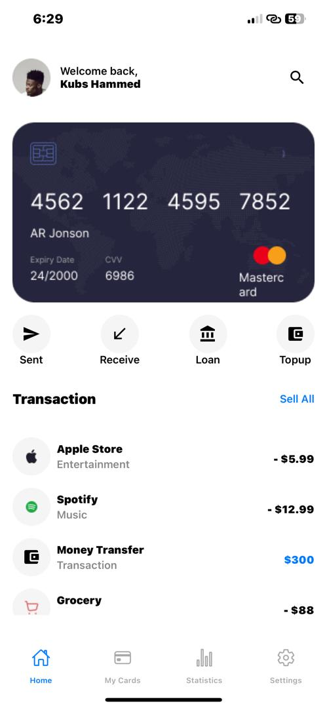

# rn-assignment5-11014893
## Overview
This app is made of four screens and includes a setting page that adapts to both light and dark modes, ensuring a seamless user experience regardless of the device's theme settings.

### Istalled Dependencies
These are the installed dependencies:
- @react-navigation/native: It is the core library for React Navigation. It provides the NavigationContainer component which is necessary for wrapping your entire navigation structure.
- @react-navigation/bottom-tabs: The library allows for the creation of a bottom tab navigator using createBottomTabNavigator. 
- @react-navigation/stack: The library allows for the creation of a stack navigator using createStackNavigator which is used for creating a stack-based navigation structure, where screens can be pushed onto or popped off the stack.

#### Features
- Theme Adaptation:
 The app dynamically adjusts its UI elements based on the device's theme settings (light or dark mode).
- Transaction List:
 Users can view a list of their recent transactions, including the merchant name, transaction type, and amount. 
- Action Buttons:
 Quick action buttons for sending money, receiving money, applying for a loan, and topping up the balance.
- Profile Section:
 A welcoming profile section that greets the user and displays their name.
- Search Functionality:
 A search icon in the header allows users to quickly search through their transactions.

### Components:
#### App.js
The main entry point of the application.
Configures the navigation structure and theme context.
Uses react-navigation to create bottom tab navigation and stack navigation.
#### App.js Component
The App.js component is the main component of the app, responsible for rendering the entire user interface. It uses various React Native components to adapt to the theme settings.

#### Transactions
The transactions are stored in an array, with each transaction including:

- ID: A unique identifier for the transaction.
- Name: The name of the merchant or transaction.
- Type: The type of transaction.
- Amount: The transaction amount.
- Icons: Icons that represent the company the user is dealing with.
#### Icons
The app uses a combination of static images and Material Icons. Specific transactions like Spotify and Grocery use static images, while other transactions and actions use Material Icons that adapt to the theme settings.

#### Implementation Details
Dynamic Icon Selection
For the Apple Store transaction, the app includes separate icons for light and dark modes. This ensures that the icon is always visible and aesthetically pleasing, regardless of the theme. When the theme changes, the app dynamically switches between the light and dark icons for the Apple Store Icon.

#### Theme Context
The app uses a ThemeContext to determine the current theme setting (light or dark mode). This context is used throughout the app to adjust the colors of text, icons, and backgrounds. For example, the text color changes to white in dark mode and black in light mode to ensure readability.

#### Action Buttons
The action buttons (Send, Receive, Loan, Topup) includes an icon and a label, both of which adapt to the theme settings. The icons are provided by Material Icons and change color based on the theme to ensure they remain visible and clear.

#### Profile Section
The profile section includes a welcoming message and the user's name. It also features a profile icon that adapts to the theme settings, ensuring it is always visible and fitting with the overall design.

#### Search Functionality
A search icon is included in the header, allowing users to quickly and easily search through their transactions.

#### Navigation
The bottom tab navigator includes tabs for Home, My Cards, Statistics, and Settings. Stack Navigator: Each tab has its own stack navigator for handling nested navigation.

